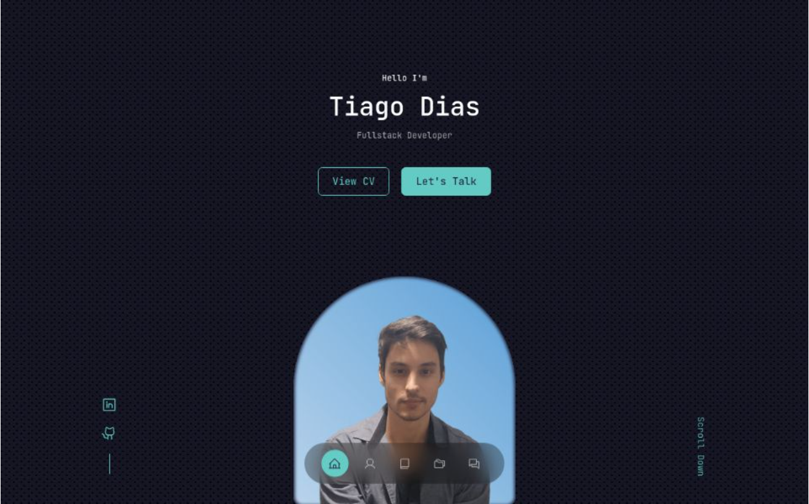

# Portfolio



## Table of Contents
1. [Introduction](#introduction)
2. [Technologies Used](#technologies-used)
3. [Features](#features)
4. [Installation](#installation)
5. [Usage](#usage)

### Introduction
Welcome to my portfolio! This project showcases my work and skills using modern web technologies. It includes various features to enhance the user experience, such as a theme selector, a contact form, and language selection.

### Technologies Used
- **React**: A JavaScript library for building user interfaces.
- **TypeScript**: A typed superset of JavaScript that compiles to plain JavaScript.
- **Styled Components**: A library for styling React components using tagged template literals.
- **Framer Motion**: A library for creating animations in React.
- **Vite**: A build tool that provides a faster and leaner development experience for modern web projects.

### Features
- **Theme Selector**: Users can choose their preferred color theme for the portfolio.
- **Contact Form**: Users can send me a message through an API endpoint which is processed by my backend.
- **Language Selection**: Users can select their preferred language (English or Brazilian Portuguese) to view the portfolio.

### Installation
1. Clone the repository:
    ```sh
    git clone https://github.com/tiago0214/tiago-portfolio
    ```
2. Navigate to the project directory:
    ```sh
    cd portfolio
    ```
3. Install dependencies:
    ```sh
    npm install
    ```

### Usage
1. Start the development server:
    ```sh
    npm run dev
    ```
2. Open your browser and navigate to the provided URL (typically `http://localhost:5173`).
